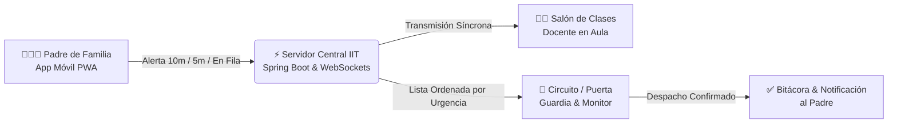

# 🛡️ Manual de Administración y Operación — IIT Pickup
**Instituto Inglés de Toluca**  
*Plataforma Integral de Logística Escolar, Control de Accesos y Seguridad en la Entrega de Alumnos*  
**Versión:** 2.0 (Producción / Ciclo Escolar 2025–2026)  
**URL de Acceso Administrativo:** [https://pickup.institutoingles.edu.mx/auth/maestros](https://pickup.institutoingles.edu.mx/auth/maestros)

---


---

## 📋 Tabla de Contenidos
1. [Introducción & Visión General de la Plataforma](#1-introducción--visión-general-de-la-plataforma)
2. [Esquema de Roles, Permisos y Seguridad](#2-esquema-de-roles-permisos-y-seguridad)
3. [Acceso al Portal y Navegación General](#3-acceso-al-portal-y-navegación-general)
4. [Módulo 1: Panel de KPIs & Métricas de Rendimiento](#4-módulo-1-panel-de-kpis--métricas-de-rendimiento)
5. [Módulo 2: Configuración de Grados y Grupos Escolares](#5-módulo-2-configuración-de-grados-y-grupos-escolares)
6. [Módulo 3: Gestión de Alumnos y Tutores Autorizados (Pickup)](#6-módulo-3-gestión-de-alumnos-y-tutores-autorizados-pickup)
7. [Módulo 4: Gestión de Maestros y Personal Escolar](#7-módulo-4-gestión-de-maestros-y-personal-escolar)
8. [Módulo 5: Gestión de Padres de Familia y Cuentas de Acceso](#8-módulo-5-gestión-de-padres-de-familia-y-cuentas-de-acceso)
9. [Módulo 6: Carga Masiva con Plantillas Excel / CSV](#9-módulo-6-carga-masiva-con-plantillas-excel--csv)
10. [Supervisión del Monitor de Entregas en Tiempo Real](#10-supervisión-del-monitor-de-entregas-en-tiempo-real)
11. [Protocolos de Seguridad y Criterios de Entrega](#11-protocolos-de-seguridad-y-criterios-de-entrega)
12. [Preguntas Frecuentes y Soporte Técnico](#12-preguntas-frecuentes-y-soporte-técnico)

---

## 🌟 1. Introducción & Visión General de la Plataforma

**IIT Pickup** es la solución tecnológica oficial del **Instituto Inglés de Toluca** desarrollada para automatizar, ordenar y blindar la seguridad del proceso de salida y entrega de alumnos en los tres niveles escolares (**Kinder / Preescolar**, **Primaria** y **Secundaria**).

### Objetivos Clave de la Plataforma:
- **Seguridad Garantizada:** Cada alumno únicamente puede ser entregado a personas previamente acreditadas con fotografía y número telefónico registrado.
- **Reducción de Congestionamiento:** Disminución de hasta un **70% en tiempos de espera** en el circuito vehicular y acceso peatonal.
- **Trazabilidad Total:** Registro digital inmutable con fecha, hora exacta, método de entrega (Auto o Peatonal) y nombre del docente o guardia que despachó al estudiante.
- **Comunicación en Tiempo Real:** Enlace síncrono mediante WebSockets entre la llegada del padre, la pantalla del salón de clases y el personal de guardia en puerta.



---

## 🔐 2. Esquema de Roles, Permisos y Seguridad

El sistema opera bajo un modelo de control de acceso basado en roles (**RBAC - Role-Based Access Control**):

| Rol en Sistema | Código de Rol | Portal de Acceso | Alcance y Capacidades Operativas |
| :--- | :--- | :--- | :--- |
| **Super Administrador** | `ADMIN` | `/auth/maestros` | Control total del sistema: gestión de alumnos, tutores, maestros, grupos escolares, reseteo de contraseñas, importación masiva y analítica de KPIs. |
| **Monitor de Puerta** | `MONITOR` | `/auth/maestros` | Guardia o coordinador de circuito: visualización del Monitor en Vivo de Entregas y consulta del Panel de KPIs. Candado activo para no modificar catálogos. |
| **Docente Titular** | `TEACHER` | `/auth/maestros` | Consulta de grupos a su cargo, visualización de lista de alumnos, verificación de familiares autorizados y despacho de alumnos. |
| **Padre / Tutor** | `PARENT` | `/auth/login` | Emisión de alertas de proximidad (`10 MIN`, `5 MIN`, `EN FILA`, `URGENTE`), cambio de modalidad (Auto / Peatonal) y confirmación de recepción. |

> [!IMPORTANT]
> Las cuentas con rol `MONITOR` tienen restringida la edición de bases de datos. Si un usuario con este rol ingresa al panel, el sistema automáticamente le mostrará el **Monitor de Entregas en Vivo** y las métricas generales de salida.

---

## 🚪 3. Acceso al Portal y Navegación General

### 3.1 Ingreso al Sistema
1. Desde cualquier navegador moderno (Google Chrome, Microsoft Edge, Safari o Firefox), ingrese a:  
   👉 **[https://pickup.institutoingles.edu.mx/auth/maestros](https://pickup.institutoingles.edu.mx/auth/maestros)**
2. Ingrese sus credenciales administrativas:
   - **Correo electrónico:** `admin@iit.edu.mx` *(o su cuenta institucional asignada)*
   - **Contraseña:** Contraseña maestra o personal configurada.
3. Haga clic en **Iniciar Sesión**.

### 3.2 Anatomía del Encabezado (Header Institucional)
El portal cuenta con un encabezado con los colores institucionales del IIT (**Azul Marino `#000e27`** y **Rojo Carmesí `#b6171e`**):

- **Logo IIT & Título:** Identidad visual del Instituto Inglés de Toluca y acceso directo a la raíz del panel.
- **Botón `🚗 Monitor de Entregas`:** Enlace directo de un clic para supervisar la fila vehicular en pantallas dedicadas o proyectores de salida.
- **Indicador de Usuario:** Muestra el nombre del administrador en sesión y su insignia oficial (`SUPER ADMIN` o `MONITOR DE ENTREGAS`).
- **Botón de Salida Segura (`🚪`):** Invalida el token JWT local y redirige a la pantalla de autenticación.

### 3.3 Barra de Navegación por Pestañas (Subnav Tabs)
El panel organiza sus funciones en 6 pestañas principales accesibles desde la barra superior:

```
[ 📊 Panel KPIs ]  [ 🏫 Grados & Grupos ]  [ 🎓 Alumnos & Tutores ]  [ 👨‍🏫 Maestros ]  [ 👨‍👩‍👧 Padres ]  [ 📂 Carga Masiva ]
```

---

## 📊 4. Módulo 1: Panel de KPIs & Métricas de Rendimiento

El **Panel de KPIs** proporciona a los directores y coordinadores una visión analítica del flujo de salida en tiempo real y el histórico de desempeño.

### 4.1 Filtro por Temporalidad
En la esquina superior derecha del módulo, seleccione el rango de análisis deseado:
- **`📅 Hoy`**: Muestra las operaciones del ciclo de salida actual.
- **`📆 Esta Semana`**: Acumulado de lunes a viernes de la semana en curso.
- **`🗓️ Este Mes`**: Tendencias del mes calendario activo.

### 4.2 Tarjetas de Indicadores Clave

| Tarjeta | Color / Icono | Significado Operativo | Meta Institucional |
| :--- | :--- | :--- | :--- |
| **Alertas Recibidas** | 📍 Azul | Total de avisos de aproximación emitidos por los padres de familia. | 100% de padres con aviso previo. |
| **Alumnos Entregados** | ✅ Verde | Total de alumnos despachados y recibidos formalmente en puerta. | Cierre del 100% de la matrícula presente. |
| **Tiempo Promedio de Entrega** | ⏱ Ámbar | Minutos transcurridos desde la alerta hasta la entrega física al auto. | **Menor a 4.5 minutos**. |
| **Franja / Hora Pico** | 🔥 Púrpura | Intervalo horario con mayor saturación de vehículos (ej. `14:10 - 14:25`). | Identificación de cuellos de botella. |

### 4.3 Desglose Gráfico
- **Distribución por Nivel Escolar:** Barras proporcionales para **Kinder** (🌱), **Primaria** (📚) y **Secundaria** (🎓), indicando número de estudiantes despachados y porcentaje del total.
- **Modalidad de Recogida:** Comparativa porcentual entre **Circuito en Auto (CAR)** y **Puerta Peatonal (WALK)**.

### 4.4 Tabla de Rendimiento por Docente / Despachador
Permite evaluar la agilidad del personal docente en la entrega de sus grupos:
- **Maestro / Personal:** Nombre del docente responsable con avatar.
- **Alumnos Despachados:** Cantidad neta de entregas registradas bajo su cuenta.
- **Tiempo Promedio:** Medido en minutos por alumno.
- **Semáforo de Efectividad:**
  - 🟢 **Excelente:** $\le 5$ minutos promedio (Barra al 95%).
  - 🟡 **Bueno:** Entre 5.1 y 7 minutos promedio (Barra al 75%).
  - 🔴 **Regular:** Mayor a 7 minutos promedio (Barra al 50%).

---

## 🏫 5. Módulo 2: Configuración de Grados y Grupos Escolares

Permite estructurar la división académica del colegio para que los alumnos y maestros se vinculen de forma organizada.

### 5.1 Tablero de 3 Columnas por Nivel Educativo
La vista se divide verticalmente en:
1. **🌱 Kinder / Preescolar** *(ej. 1° Kinder, 2° Kinder, 3° Preescolar).*
2. **📚 Primaria** *(ej. 1° a 6° de Primaria, grupos A, B, C).*
3. **🎓 Secundaria** *(ej. 1° a 3° de Secundaria, grupos A, B, C, D, E).*

Cada tarjeta de grupo exhibe:
- **Nombre oficial del grupo** (ej. `3o. de Secundaria-B`).
- **Contador de alumnos matriculados** (`👥 28 alumnos`).
- **Botón `✏️ Editar`**: Modifica la nomenclatura o grado.
- **Botón `🗑️ Eliminar`**: Da de baja el salón (únicamente si no cuenta con alumnos activos asignados).

### 5.2 Procedimiento para Crear un Nuevo Grupo
1. Haga clic en el botón superior **`+ Nuevo Grupo`** (o en el botón `+` de la columna correspondiente).
2. Complete el formulario modal:
   - **Nivel Escolar:** Seleccione `KINDER`, `PRIMARIA` o `SECUNDARIA`.
   - **Grado:** Especifique el grado correspondiente (ej. `Segundo de Primaria`).
   - **Nombre de Grupo:** Escriba la clave distintiva (ej. `2o. de Primaria-A`).
3. Presione **Guardar Grupo**. La lista se actualizará inmediatamente en tiempo real.

---

## 🎓 6. Módulo 3: Gestión de Alumnos y Tutores Autorizados (Pickup)

Este es el módulo neurálgico del sistema, donde se custodia la información de cada estudiante y las personas legalmente acreditadas para recogerlo.

### 6.1 Barra de Filtros en Cascada
Para localizar rápidamente a cualquier alumno entre cientos de registros:
- **Búsqueda Dinámica (`🔍`):** Ingrese cualquier fragmento del nombre, apellidos o clave **CURP**.
- **Filtro por Grado:** Selector que agrupa los grados disponibles en el colegio.
- **Filtro por Grupo:** Menú desplegable con los salones activos.
- **Píldoras de Nivel:** Botones rápidos para conmutar entre `Todos`, `Kinder`, `Primaria` y `Secundaria`.
- **Ordenamiento de Columnas:** Haga clic en el encabezado de las columnas `Alumno`, `Nivel & Grado` o `Grupo` para ordenar en sentido ascendente (`▲`) o descendente (`▼`).

### 6.2 Alta y Edición de un Alumno (Paso a Paso)

Haga clic en **`+ Nuevo Alumno`** o en el icono **`✏️`** de cualquier fila existente para abrir el modal de captura:

#### A. Datos Generales del Estudiante
1. **Nombre Completo (*):** Nombre(s) y apellidos en mayúsculas (ej. `HERNÁNDEZ OSORNIO, ÓSCAR ALONSO`).
2. **Nivel Escolar (*):** Seleccione entre Kinder, Primaria o Secundaria.
3. **Grado Escolar:** Grado correspondiente (ej. `Tercero de Secundaria`).
4. **Grupo Asignado:** Seleccione el salón del menú.  
   *(El sistema desplegará automáticamente un banner informativo indicando los nombres de los docentes asignados a ese grupo).*
5. **Fecha de Nacimiento:** Selección mediante calendario con validación de edad escolar.
6. **Sexo (*):** `👦 M - Masculino` o `👧 F - Femenino`.
7. **CURP:** Clave Única de Registro de Población a 18 caracteres.

#### B. Fotografía Oficial del Alumno
- Haga clic en **`📁 Seleccionar desde mi dispositivo`** para cargar una imagen desde su equipo o tomar la foto con la cámara de una tablet.
- **Procesamiento Inteligente:** La plataforma optimiza la fotografía en Cloudinary, aplicando **detección facial y recorte centrado a 400x400 píxeles**.
- Formatos aceptados: `JPG`, `PNG`, `WEBP` (peso máximo 2 MB).
- Botón **`Quitar foto`** disponible en caso de reemplazo.

#### C. Registro de Familiares / Tutores Autorizados (Hasta 3)
La sección inferior permite capturar hasta tres personas facultadas para el retiro del menor:

```
┌────────────────────────────────────────────────────────────────────────┐
│ Tutor #1                                  [X] Autorizado para recoger  │
├────────────────────────────────────────────────────────────────────────┤
│ Nombre Completo:  GARCÍA LÓPEZ, MARIANA                                │
│ Parentesco:       [ Mamá           ▼ ]                                 │
│ Teléfono Móvil:   722 123 4567                                         │
└────────────────────────────────────────────────────────────────────────┘
```

- **Switch `Autorizado`:** Permite deshabilitar temporalmente a un tutor (por ejemplo, por mandato legal o cambio de tutoría) sin borrar su historial.
- **Parentescos Disponibles:** `Mamá`, `Papá`, `Tutor Legal`, `Abuelo/a`, `Tío/a`, `Chofer Escolar / Transporte`.
- **Teléfono de Contacto:** 10 dígitos numéricos para enlace de emergencia.

8. Haga clic en **Guardar Alumno**. La información se reflejará al instante en el portal docente y en el monitor de entregas.

---

## 👨‍🏫 7. Módulo 4: Gestión de Maestros y Personal Escolar

Administre a la plantilla de profesores y asigne los salones sobre los cuales tendrán visibilidad y control de despacho.

### 7.1 Catálogo de Personal
- **Buscador:** Filtrado por nombre de profesor o correo institucional.
- **Filtro por Rol:** `Todos`, `Docentes (TEACHER)`, `Monitores de Puerta (MONITOR)`, `Administradores (ADMIN)`.
- **Filtro por Grupo:** Permite ver únicamente a los docentes asignados a una sección específica.

### 7.2 Acciones sobre Cuentas Docentes
- **`✏️ Editar`:** Modifica el nombre, correo, nivel o grupos asignados.
- **`🔑 Resetear Contraseña`:** Abre un diálogo de confirmación para restablecer la contraseña del maestro a la clave temporal institucional (`IIT2026`). Al iniciar sesión, el sistema le solicitará definir una nueva contraseña privada.
- **Switch de Estado `Activo / Inactivo`:** Desactiva de inmediato el acceso de un profesor que cause baja o licencia sin eliminar su historial de despachos.

---

## 👨‍👩‍👧 8. Módulo 5: Gestión de Padres de Familia y Cuentas de Acceso

Control de las cuentas que utilizan los padres de familia en la aplicación móvil para avisar su llegada al colegio.

### 8.1 Nomenclatura Estándar de Usuario
Para garantizar simplicidad y evitar confusiones:
- **Formato de Usuario:** `[Primera Letra del Nombre] + [Primer Apellido]`
- *Ejemplos:*
  - Eliseo Aguilar Sierra $\rightarrow$ `EAGUILAR`
  - Tania Vianey Carrión $\rightarrow$ `TCARRION`
  - En caso de homónimos, el sistema numera correlativamente (`EAGUILAR2`, `EAGUILAR3`).

### 8.2 Vinculación de Alumnos (Hermanos)
Un solo padre de familia puede tener uno o varios hijos en diferentes grados o niveles escolares:
1. En la tabla de padres, ubique la fila del tutor y haga clic en **`✏️ Editar`** o **`🔗 Vincular Alumnos`**.
2. En el panel de vinculación, busque a los estudiantes por nombre y selecciónelos con un clic.
3. Al guardar, el padre de familia verá pestañas independientes para cada hijo dentro de su aplicación móvil, pudiendo solicitar la entrega de ambos de forma coordinada.

### 8.3 Restablecimiento de Credenciales de Padres
Si un padre olvidó su acceso:
1. Localice la cuenta del padre en el buscador.
2. Haga clic en el botón **`🔑 Resetear`**.
3. Confirme el restablecimiento: la contraseña volverá a ser `IIT2026` y se activará la bandera de contraseña temporal obligatoria.

---

## 📂 9. Módulo 6: Carga Masiva con Plantillas Excel / CSV

Para inicios de ciclo escolar o actualizaciones masivas de cientos de alumnos, el sistema incluye un motor de procesamiento por lotes vía CSV.

### 9.1 Tipos de Importación Disponibles
Seleccione la pestaña correspondiente en la parte superior:
1. **🎓 Alumnos & Tutores:** Da de alta a los estudiantes, sus salones y sus tutores autorizados.
2. **👨‍🏫 Maestros & Grupos:** Da de alta cuentas de profesores y sus asignaciones de aula.
3. **👨‍👩‍👧 Padres de Familia:** Genera las cuentas de acceso del portal móvil y vincula matrículas.

### 9.2 Procedimiento de Carga
1. Haga clic en **`📥 Descargar Plantilla Oficial`**.
2. Abra el archivo descargado en Microsoft Excel o Google Sheets.
3. Ingrese la información respetando estrictamente los nombres de las columnas:
   - No modifique los encabezados de la fila 1.
   - Guarde el archivo con formato **Valores separados por comas (`.csv`)** con codificación **UTF-8**.
4. Arrastre el archivo a la zona **Dropzone** o haga clic en **`Examinar archivo CSV`**.
5. Presione **`🚀 Iniciar Importación Masiva`**.
6. **Resumen de Resultados:** Al concluir, el sistema mostrará:
   - ✅ Registros procesados exitosamente.
   - ⚠️ Filas con inconsistencias (con desglose de la causa: formato de CURP inválido, grupo inexistente, etc.).

---

## 🚗 10. Supervisión del Monitor de Entregas en Tiempo Real

El acceso directo `/monitor` despliega la interfaz de operaciones en vivo pensada para pantallas de gran formato en salones y garitas de entrega:

### 10.1 Jerarquía Visual por Estado de Alerta
Las tarjetas de los alumnos se ordenan automáticamente según su prioridad:

```
┌────────────────────────────────────────────────────────────────────────┐
│ 🚨 URGENTE (Rojo Carmesí)                                              │
│ Alumno en puerta por contingencia o permiso especial validado.         │
├────────────────────────────────────────────────────────────────────────┤
│ 🚗 EN FILA / YA EN COLEGIO (Azul Marino IIT)                           │
│ El padre ha ingresado a la bahía de estacionamiento o fila vehicular.   │
├────────────────────────────────────────────────────────────────────────┤
│ ⏱ A 5 MINUTOS (Ámbar Dorado)                                          │
│ El alumno debe empacar sus pertenencias y bajar a zona de espera.      │
├────────────────────────────────────────────────────────────────────────┤
│ 🕐 A 10 MINUTOS (Gris Neutral)                                         │
│ Alerta preventiva de preparación.                                      │
└────────────────────────────────────────────────────────────────────────┘
```

### 10.2 Protocolo de Despacho
1. Cuando el vehículo del tutor avanza frente a la bahía de entrega, el guardia valida la fotografía del alumno y del tutor que conduce.
2. El personal presiona el botón **`🚗 Despachar Alumno`**.
3. **Acción Instantánea:** La tarjeta desaparece de todas las pantallas del colegio y el padre recibe una notificación auditiva y vibratoria en su teléfono indicando **"Alumno Entregado en Puerta"**.
4. La operación queda grabada en la base de datos para cualquier auditoría posterior.

---

## 🛡️ 11. Protocolos de Seguridad y Criterios de Entrega

> [!CAUTION]
> **Regla de Oro Institucional:** Bajo ninguna circunstancia se despachará a un alumno a una persona que no se encuentre registrada en el sistema con estatus **`Autorizado: SÍ`** dentro de los tutores acreditados.

### 11.1 Casos Especiales y Contingencias
- **Presentación de Tutor no Registrado:** El guardia debe solicitar al tutor que se estacione en zona de espera y canalizarlo con la Dirección del plantel para validación telefónica directa con la madre o padre titular.
- **Retiro Peatonal por Alumnos de Secundaria:** Solo permitido si la ficha del alumno cuenta con el permiso explícito y firmado resguardado en el expediente escolar.
- **Fallas de Red / Sin Conexión del Padre:** El personal de garita puede registrar la llegada manual del padre directamente en el monitor de entregas buscando al alumno por su nombre.

---

## ❓ 12. Preguntas Frecuentes y Soporte Técnico

### P1: ¿Qué hago si un padre de familia no puede entrar a la aplicación?
1. Ingrese a la pestaña **`👨‍👩‍👧 Padres`**.
2. Busque por el nombre del padre y confirme su usuario (ej. `EAGUILAR`).
3. Verifique que el estatus esté en **Activo**.
4. Haga clic en **`🔑 Resetear`** para restablecer la contraseña a `IIT2026`.
5. Indique al padre que ingrese con dicho usuario y clave.

### P2: ¿Cómo agrego a un chofer o transporte escolar para varios alumnos?
1. Ingrese a la pestaña **`🎓 Alumnos & Tutores`**.
2. Edite la ficha de cada uno de los niños que viajarán en ese transporte.
3. En la sección de tutores (ej. Tutor #3), capture el nombre completo del chofer, seleccione el parentesco `Chofer Escolar / Transporte` e ingrese su teléfono móvil.
4. Asegúrese de que el switch **`Autorizado`** esté activo.

### P3: ¿El monitor de entregas requiere recargar la página (`F5`) para actualizarse?
**No.** La plataforma funciona con WebSockets bidireccionales. Cualquier alerta enviada por un padre o cualquier despacho realizado por un maestro se refleja en milisegundos sin necesidad de refrescar el navegador.

---

### 📞 Directorio de Soporte Técnico IIT
- **Área:** Coordinación de Tecnologías de la Información y Seguridad Escolar
- **Ubicación:** Edificio Administrativo — Instituto Inglés de Toluca
- **Soporte en Línea:** `soporte@institutoingles.edu.mx`
- **Horario de Atención:** Lunes a Viernes de 07:00 a 16:00 hrs.

---
*Manual oficial aprobado por la Dirección General del Instituto Inglés de Toluca. Prohibida su reproducción total o parcial sin autorización expresa.*
