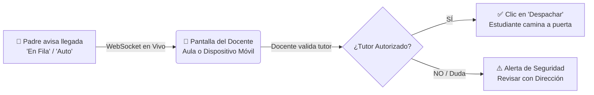
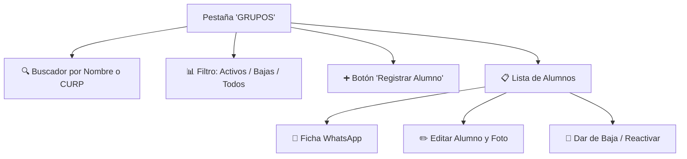

# 🧑‍🏫 Manual del Docente — Portal de Maestros IIT Pickup
**Instituto Inglés de Toluca**  
*Plataforma Integral de Logística Escolar, Control de Salidas y Seguridad en la Entrega de Alumnos*  
**Versión:** 2.0 (Ciclo Escolar 2025–2026)  
**URL Oficial de Acceso:** [https://pickup.institutoingles.edu.mx/auth/maestros](https://pickup.institutoingles.edu.mx/auth/maestros)

---


---

## 📋 Tabla de Contenidos

1. [Introducción & Propósito del Portal de Maestros](#1-introducción--propósito-del-portal-de-maestros)
2. [Acceso al Sistema y Configuración Inicial](#2-acceso-al-sistema-y-configuración-inicial)
3. [Navegación General y Entorno de Trabajo](#3-navegación-general-y-entorno-de-trabajo)
4. [Módulo 1: Monitor de Salidas en Vivo (Pestaña MONITOR)](#4-módulo-1-monitor-de-salidas-en-vivo-pestaña-monitor)
   - 4.1 Estados de proximidad del vehículo / tutor
   - 4.2 Métodos de entrega: Auto vs. Peatonal
   - 4.3 Despacho de alumnos y registro de salida
   - 4.4 Reversión de entregas por aclaración o demora
5. [Módulo 2: Consulta y Gestión del Salón Asignado (Pestaña GRUPOS)](#5-módulo-2-consulta-y-gestión-del-salón-asignado-pestaña-grupos)
   - 5.1 Buscador y ordenamiento inteligente
   - 5.2 Filtro por estado: Alumnos Activos, Bajas y Total
6. [Módulo 3: Ficha y Envío de Credenciales por WhatsApp a Padres](#6-módulo-3-ficha-y-envío-de-credenciales-por-whatsapp-a-padres)
   - 6.1 Mensaje automático con contraseña temporal (IIT2026)
   - 6.2 Detección de contraseña personal ya configurada
   - 6.3 Restablecimiento de clave a IIT2026 en un solo clic
   - 6.4 Envío por WhatsApp Web o aplicación móvil
7. [Módulo 4: Alta de Nuevos Alumnos en el Salón](#7-módulo-4-alta-de-nuevos-alumnos-en-el-salón)
   - 7.1 Paso 1: Datos escolares y fotografía del alumno
   - 7.2 Paso 2: Cuenta de acceso para los padres (Portal Web)
   - 7.3 Vinculación inteligente de familias con múltiples hijos
   - 7.4 Paso 3: Registro de tutores autorizados para recoger
8. [Módulo 5: Edición de Alumnos y Tutores de Entrega](#8-módulo-5-edición-de-alumnos-y-tutores-de-entrega)
   - 8.1 Actualización de datos generales y fotografía
   - 8.2 Modificación de familiares autorizados y teléfonos
9. [Módulo 6: Bajas Seguras (Soft Delete) y Reactivación](#9-módulo-6-bajas-seguras-soft-delete-y-reactivación)
   - 9.1 ¿Por qué desactivar en lugar de borrar? (Protección del historial)
   - 9.2 Procedimiento para dar de baja a un alumno
   - 9.3 Reactivación inmediata de alumnos
10. [Módulo 7: Uso en Dispositivos Móviles y Aplicación PWA](#10-módulo-7-uso-en-dispositivos-móviles-y-aplicación-pwa)
11. [Protocolos de Seguridad y Buenas Prácticas en el Aula](#11-protocolos-de-seguridad-y-buenas-prácticas-en-el-aula)
12. [Preguntas Frecuentes y Soporte Técnico](#12-preguntas-frecuentes-y-soporte-técnico)

---

## 🌟 1. Introducción & Propósito del Portal de Maestros

El **Portal de Maestros de IIT Pickup** es la herramienta diseñada especialmente para que los profesores titulares y docentes del **Instituto Inglés de Toluca** coordinen la entrega segura, rápida y ordenada de sus estudiantes durante la hora de salida escolar.

### Objetivos Clave para el Docente:
* **Cero Entregas No Autorizadas:** Identifique visualmente mediante fotografía a los tutores autorizados antes de permitir que el estudiante salga del aula.
* **Eliminación del Ruido y Voceo por Altavoces:** El sistema proyecta o notifica en tiempo real en la pantalla del salón qué vehículos han llegado a la fila de entrega.
* **Autonomía Administrativa en el Aula:** El maestro puede registrar alumnos de nuevo ingreso a su grupo, gestionar a los familiares autorizados, generar y enviar accesos por WhatsApp, y registrar bajas temporales sin depender de citas administrativas.
* **Histórico y Trazabilidad:** Cada alumno despachado queda registrado con segundo exacto, fecha, método de entrega y nombre del docente que autorizó la salida.



---

## 🔐 2. Acceso al Sistema y Configuración Inicial

### 2.1 Datos de Acceso
1. Desde cualquier computadora de aula, tablet o teléfono inteligente, abra el navegador web (Google Chrome, Microsoft Edge, Safari) e ingrese a:  
   👉 **[https://pickup.institutoingles.edu.mx/auth/maestros](https://pickup.institutoingles.edu.mx/auth/maestros)**
2. Introduzca sus credenciales:
   * **Correo electrónico institucional:** `profesor@institutoingles.edu.mx`
   * **Contraseña:** Su clave privada asignada.
3. Presione el botón **Iniciar Sesión**.

> [!NOTE]
> Su sesión se mantiene activa de forma segura. Si el equipo es de uso compartido en el aula, recuerde hacer clic en el botón **Cerrar Sesión (`🚪`)** al concluir su jornada laboral.

---

## 🧭 3. Navegación General y Entorno de Trabajo

La interfaz de trabajo del maestro está organizada en una barra superior institucional y dos modos de trabajo principales:

```
┌─────────────────────────────────────────────────────────────────────────────────────────┐
│ 🏫 IIT PICKUP   [🚗 MONITOR EN VIVO]  [🏫 MI SALÓN / GRUPOS]   ☀️/🌙  Prof. Morales 🚪 │
└─────────────────────────────────────────────────────────────────────────────────────────┘
```

* **Pestaña `🚗 MONITOR`:** Vista operativa en tiempo real para proyectar en el aula o revisar la fila de vehículos mientras los padres van llegando.
* **Pestaña `🏫 GRUPOS`:** Centro de administración de su salón de clases: catálogo de alumnos, fichas de WhatsApp, altas, bajas y edición de tutores.
* **Selector de Tema `☀️ / 🌙`:** Alterne entre modo claro (recomendado para tablets de patio) y modo oscuro (ideal para proyecciones en aula con proyector).
* **Contador de Salidas Activas:** Muestra en tiempo real cuántos alumnos están en proceso de entrega en el colegio.

---

## 🚗 4. Módulo 1: Monitor de Salidas en Vivo (Pestaña MONITOR)

La pestaña **MONITOR** es el corazón operativo de la salida escolar. Se actualiza **automáticamente sin recargar la página** gracias a la conexión por WebSockets de alta velocidad.

### 4.1 Estados de Proximidad del Padre de Familia
A medida que el padre se desplaza al colegio, la tarjeta del alumno muestra diferentes estados cromáticos:

| Estado Visual | Color | Significado Operativo | Acción Recomendada para el Docente |
| :--- | :--- | :--- | :--- |
| **`10 MIN`** | 🟡 Amarillo | El padre inició su trayecto hacia el colegio. | Modo preventivo. El alumno puede comenzar a guardar materiales. |
| **`5 MIN`** | 🟠 Naranja | El vehículo está en las inmediaciones del circuito. | Alistar mochila y chamarra. El alumno debe estar atento en su asiento. |
| **`EN FILA`** | 🔵 Azul | El vehículo se incorporó formalmente a la bahía de entrega. | **Llamar al alumno al frente.** Está a segundos de llegar a la puerta. |
| **`URGENTE`** | 🔴 Rojo | Situación de prioridad o retiro especial autorizado. | Despacho inmediato prioritario hacia la puerta principal. |

### 4.2 Métodos de Entrega: Auto vs. Peatonal
Cada tarjeta indica claramente cómo se recogerá al alumno:
* 🚗 **Auto (Vehicular):** El padre ingresa por el carril vehicular del colegio. Se indica el modelo, color de vehículo y placas si están registradas.
* 🚶 **Peatonal:** El tutor se encuentra esperando a pie en la puerta peatonal del plantel.

### 4.3 Despacho de Alumnos y Registro de Salida
1. Al llegar el vehículo a la bahía de entrega (`EN FILA`), ubique la tarjeta del estudiante.
2. Compruebe visualmente el tutor responsable en pantalla.
3. Presione el botón verde **`✅ Despachar`**.
4. El sistema registrará el evento en la bitácora institucional y enviará una notificación instantánea al teléfono del padre confirmando que su hijo va en camino al vehículo.

### 4.4 Reversión de Entregas (`🔄 Revertir`)
Si un alumno fue despachado por equivocación o se detuvo en el salón a recoger un objeto olvidado:
1. En la lista de entregados del día, presione el botón **`🔄 Revertir Entrega`**.
2. El alumno regresará de inmediato a la lista activa en pantalla y se le notificará al guardia de la puerta para retener el vehículo con seguridad.

---

## 🏫 5. Módulo 2: Consulta y Gestión del Salón Asignado (Pestaña GRUPOS)

Al ingresar a la pestaña **GRUPOS**, el docente tiene acceso exclusivo al padrón de estudiantes de sus salones asignados (por ejemplo, *3o. de Secundaria-C*).



### 5.1 Buscador y Ordenamiento Inteligente
* **Barra de Búsqueda:** Escriba cualquier fragmento del nombre, apellido o clave CURP del estudiante para filtrar al instante.
* **Ordenamiento por Columnas:** Haga clic en los encabezados de columna para ordenar alfabéticamente por:
  * `Alumno (A–Z / Z–A)`
  * `Grado Escolar`
  * `Número de Tutores Autorizados`

### 5.2 Filtro por Estado: Activos, Bajas y Total
En la barra de herramientas superior encontrará tres selectores tipo píldora:
* **`Activos (X)` (Seleccionado por defecto):** Muestra únicamente a los estudiantes regulares inscritos que asisten a clases y salen por el circuito de pickup.
* **`Bajas (Y)`:** Muestra a los alumnos que han sido dados de baja temporal o egresados. Se muestran con una atenuación visual sutil y el distintivo `🚫 Baja`.
* **`Todos (Z)`:** Despliega el histórico consolidado del salón.

---

## 💬 6. Módulo 3: Ficha y Envío de Credenciales por WhatsApp a Padres

Una de las herramientas más potentes del portal es el **Generador de Ficha y Mensaje de Acceso para WhatsApp**. Permite al docente compartir de forma inmediata las claves de acceso al padre de familia sin intermediación de secretaría.

### 6.1 Cómo Abrir la Ficha de Acceso
1. En la lista de alumnos de su salón, localice la fila del estudiante.
2. Presione el botón verde **`💬 Acceso`** (o en celular, **`💬 Acceso Padres (WhatsApp)`**).
3. Se desplegará la ventana modal interactiva con el mensaje listo para ser enviado.

### 6.2 Detección Inteligente del Estado de Contraseña

#### Caso A: El padre aún no ha ingresado al portal (`Clave Temporal: IIT2026`)
El sistema detecta automáticamente que la cuenta tiene contraseña provisional y genera este mensaje:

```text
🚗 IIT Pickup — Acceso al Portal de Padres

Estimado/a Juan Pérez, le compartimos sus credenciales de acceso para Sofía García Martínez (3o. de Secundaria-C):

🌐 Portal: https://pickup.institutoingles.edu.mx/auth/padres
👤 Usuario: juan.perez@gmail.com
🔑 Contraseña temporal: IIT2026

⚠️ Por la seguridad de su hijo/a, al ingresar por primera vez el sistema le solicitará crear su contraseña personal e intransferible.
```

#### Caso B: El padre ya configuró su contraseña personal
Por estrictas normas de seguridad bancaria y criptográfica (cifrado unidireccional BCrypt), nadie puede ver la contraseña que el padre eligió. El mensaje se adapta automáticamente:

```text
🚗 IIT Pickup — Acceso al Portal de Padres

Estimado/a Juan Pérez, le compartimos el enlace de acceso al sistema para Sofía García Martínez (3o. de Secundaria-C):

🌐 Portal: https://pickup.institutoingles.edu.mx/auth/padres
👤 Usuario: juan.perez@gmail.com
🔑 Contraseña: Ya configurada previamente por usted.

💡 Si olvidó su contraseña, puede solicitarnos restablecerla temporalmente a IIT2026.
```

### 6.3 Botón "🔄 Restablecer a IIT2026" (Recuperación en 1 Clic)
Si el padre de familia le comenta que olvidó su contraseña:
1. En la misma ventana de la ficha, observe la barra inferior: *«¿El padre olvidó su contraseña?»*.
2. Presione el botón **`🔄 Restablecer a IIT2026`**.
3. El sistema valida sus permisos como docente del alumno, resetea la contraseña en la base de datos a `IIT2026` y **actualiza el mensaje de WhatsApp en ese mismo segundo**.
4. Ahora puede enviarle el mensaje con su nueva clave temporal.

### 6.4 Envío por WhatsApp
* **Botón `📋 Copiar Mensaje`:** Copia el texto completo formateado al portapapeles. Ideal si usa WhatsApp Web en su computadora.
* **Botón `💬 Abrir en WhatsApp`:** Si el padre tiene teléfono registrado, abre directamente el chat privado de WhatsApp con el mensaje ya escrito listo para presionar "Enviar".

---

## ➕ 7. Módulo 4: Alta de Nuevos Alumnos en el Salón

Los maestros cuentan con la capacidad de dar de alta nuevos alumnos directamente en su grupo escolar con un flujo guiado en 3 pasos:

### Paso 1: Iniciar el Registro
1. En la pestaña **GRUPOS**, haga clic en el botón verde superior **`➕ Registrar Alumno`**.
2. Verifique que el encabezado indique su salón de clases asignado.

### Paso 2: Datos Escolares del Alumno
* **Nombre Completo (* Obligatorio):** Ingrese Apellidos y Nombres (ej. *García Martínez Sofía*).
* **CURP:** Clave Única de Registro de Población (opcional pero recomendada).
* **Grado Escolar:** Pre-llenado automáticamente con el nombre de su grupo.
* **Sexo:** Seleccione Masculino (👦) o Femenino (👧).
* **Fecha de Nacimiento:** Seleccione en el calendario interactivo.
* **Fotografía:** Presione `📷 Seleccionar Foto` para subir una imagen del alumno desde su dispositivo. El sistema la optimizará automáticamente con detección facial.

### Paso 3: Cuenta de Acceso para Padres (Portal Web)
* **Nombre del Padre/Tutor:** Nombre del titular que accederá a la aplicación.
* **Correo Electrónico (* Obligatorio):** Este correo será su **Usuario de Inicio de Sesión**.
* **Teléfono WhatsApp:** Número celular a 10 dígitos.
* **Casilla "Copiar automáticamente como Tutor Autorizado de Salida":** Déjela activada para evitar tener que escribir dos veces los mismos datos.

> [!TIP]
> **Vinculación Inteligente de Familias:** Si el correo que ingresa pertenece a un padre que ya tiene otro hijo en Primaria o Preescolar, el sistema **no duplicará la cuenta**. Automáticamente vinculará al nuevo estudiante al perfil que el padre ya utiliza con su contraseña de siempre.

### Paso 4: Tutores Autorizados para Recoger (Pickup)
Configure hasta 3 personas autorizadas para recoger al estudiante:
* **Nombre completo** (ej. *Mamá, Papá, Abuela, Chofer*).
* **Parentesco** y **Teléfono**.
* **Casilla "Autorizado para recoger":** Active o desactive según las instrucciones de custodia de la familia.

### Paso 5: Guardar y Envío Inmediato
Presione **`Guardar y Generar Acceso`**.  
Al guardarse con éxito, el sistema **abrirá inmediatamente la Ficha de WhatsApp** para que pueda enviarle sus credenciales al padre en ese mismo momento.

---

## ✏️ 8. Módulo 5: Edición de Alumnos y Tutores de Entrega

Si un alumno cambia de teléfono, tutor o requiere actualizar su fotografía:
1. En la tabla de su salón, presione el botón azul **`✏️ Editar`**.
2. Modifique los campos necesarios.
3. Para cambiar la foto, seleccione una nueva imagen.
4. Presione **`Guardar Cambios`**. Los cambios se reflejan al instante en todos los monitores del colegio y en la puerta de salida.

---

## 🚫 9. Módulo 6: Bajas Seguras (Soft Delete) y Reactivación

### 9.1 ¿Por qué no se borran los alumnos físicamente?
En un sistema de seguridad escolar, **eliminar un alumno de la base de datos destruiría la evidencia legal**:
* ¿Quién lo recogió hace un mes?
* ¿A qué hora salió el día 15?
* ¿Qué maestro lo autorizó?

Por esta razón, IIT Pickup utiliza **Bajas Seguras (Inactivación)**: el estudiante deja de aparecer en las listas de salida diarias, pero todo su historial histórico queda protegido e inalterable.

### 9.2 Procedimiento para Dar de Baja a un Alumno
1. En la fila del estudiante activo, presione el botón rojo **`🚫 Baja`**.
2. Aparecerá la ventana de confirmación:
   * *«¿Estás seguro de que deseas dar de baja a [Nombre del Alumno]?»*
3. Presione **`Sí, Dar de Baja`**.
4. El estudiante se moverá automáticamente a la pestaña de **Bajas** y dejará de generar llamadas en la puerta.

### 9.3 Procedimiento de Reactivación
Si el alumno regresa al colegio o se trató de un error:
1. En la barra superior, seleccione la píldora **`Bajas (X)`**.
2. Localice al alumno y presione el botón verde **`🔄 Activar`**.
3. Confirme la reactivación y el estudiante estará disponible nuevamente en la lista activa.

---

## 📱 10. Módulo 7: Uso en Dispositivos Móviles y Aplicación PWA

IIT Pickup está desarrollado bajo el estándar **PWA (Progressive Web App)**, lo que permite utilizarlo como una aplicación nativa en celulares y tablets sin necesidad de descargarlo de tiendas de aplicaciones.

### Cómo instalarlo en su celular:
* **En Android (Google Chrome):** Toque los tres puntos del menú superior y elija **`Agregar a la pantalla principal`** o **`Instalar aplicación`**.
* **En iPhone / iPad (Safari):** Toque el botón de compartir (icono de cuadro con flecha hacia arriba) y elija **`Agregar a pantalla de inicio`**.

### Ventajas en Móvil:
* Icono directo institucional del IIT en su pantalla de inicio.
* Funcionamiento fluido a pantalla completa sin barras de navegador.
* Botones táctiles amplios diseñados para operar cómodamente caminando por el aula o en el patio.

---

## 🛡️ 11. Protocolos de Seguridad y Buenas Prácticas en el Aula

1. **Verificación Visual Mandatoria:** Antes de presionar "Despachar", corrobore que el nombre o fotografía en pantalla coincida con el tutor que se encuentra en la bahía o puerta.
2. **Custodias y Restricciones:** Si un familiar pierde la patria potestad o tiene restricción legal, ingrese a la edición del alumno y desmarque la casilla `Autorizado para recoger` o retire su registro.
3. **No Compartir Contraseñas:** Cada docente debe utilizar su propia cuenta. Las acciones de despacho quedan grabadas bajo el nombre del maestro en sesión para efectos de auditoría institucional.
4. **Alumnos No Retirados:** Si un vehículo fue llamado pero el padre no avanzó o se retiró de la fila, utilice **`Revertir Entrega`** de inmediato para evitar discrepancias con el personal de guardia.

---

## ❓ 12. Preguntas Frecuentes y Soporte Técnico

**¿Qué hago si un padre de familia dice que no puede entrar a la app?**  
Abra la ficha de acceso (`💬 Acceso`) del alumno, presione `🔄 Restablecer a IIT2026` y reenvíele el mensaje por WhatsApp. Asegúrese de que esté ingresando al dominio correcto: `https://pickup.institutoingles.edu.mx/auth/padres`.

**¿Puedo dar de alta a un alumno en un grupo que no me corresponde?**  
No. Por seguridad escolar, el sistema valida que usted sea el titular del salón. Si necesita mover a un alumno de grupo, solicítelo al Administrador General.

**¿Qué pasa si un padre tiene 2 hijos en diferentes salones?**  
Al dar de alta al nuevo alumno, use el mismo correo del padre. El sistema lo vinculará automáticamente y el padre verá a ambos hijos en su misma aplicación con una sola contraseña.

---

### 📞 Directorio de Soporte Técnico IIT
* **Coordinación de Sistemas IIT:** `soporte@institutoingles.edu.mx`
* **Dirección Escolar:** `direccion@institutoingles.edu.mx`
* **Plataforma Web Oficial:** [https://pickup.institutoingles.edu.mx](https://pickup.institutoingles.edu.mx)
